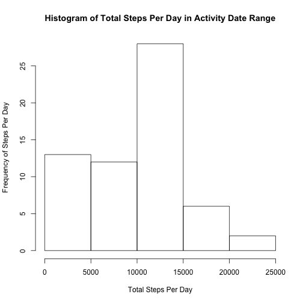
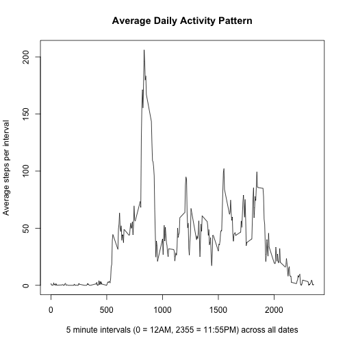
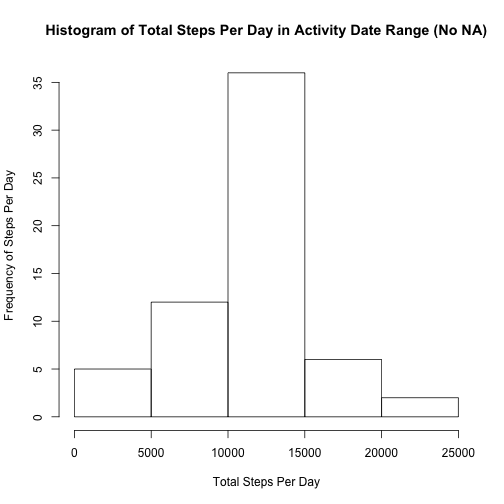
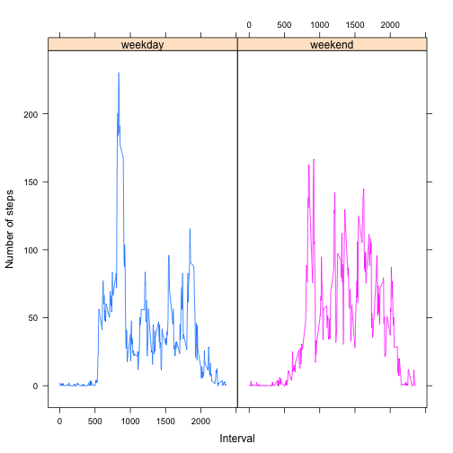

# Reproducible Research: Peer Assessment 1


## Loading and preprocessing the data


Take in activity data csv and convert string date to POSIXct format

Here is the code for this step:


```r
## Load csv
activity_rawdata <- read.csv(file = "activity.csv", stringsAsFactors=F)

## Change date from string to date class 
date_converted <- strptime(activity_rawdata$date,format = "%Y-%m-%d")

## combine with raw data for our activity set to use
activity_processed <- cbind(activity_rawdata,date_converted)
```


## What is mean total number of steps taken per day?


In this code total steps per day is calculated and a histogram is created showing the data


```r
## sum each days steps - counting NA as 0
sum_steps_per_day <- aggregate(activity_processed$steps,list(activity_processed$date_converted),FUN = sum,na.rm=T)

hist(sum_steps_per_day$x,main="Histogram of Total Steps Per Day in Activity Date Range", xlab="Total Steps Per Day", ylab="Frequency of Steps Per Day")
```

 


In this code the mean and median total number of steps taken per day is calculated and displayed


```r
## take the mean and median and ready for output
mean_steps <- mean(sum_steps_per_day$x)
median_steps <- median(sum_steps_per_day$x)
cbind(mean_steps,median_steps)
```

```
##      mean_steps median_steps
## [1,]       9354        10395
```


## What is the average daily activity pattern?


Here we aggregate the average steps taken over the date range by the interval and show a time series plot


```r
average_steps_by_interval <- aggregate(activity_processed$steps,list(activity_processed$interval),FUN = mean,na.rm=T)
plot(average_steps_by_interval$Group.1,average_steps_by_interval$x,type="l",xlab="5 minute intervals (0 = 12AM, 2355 = 11:55PM) across all dates", ylab="Average steps per interval", main="Average Daily Activity Pattern")
```

 


To see on average across all the days in the dataset, which interval contains the maximum number of steps we run this code


```r
average_steps_by_interval[max(average_steps_by_interval$x) == average_steps_by_interval$x,]
```

```
##     Group.1     x
## 104     835 206.2
```


This shows that the interval that has the maximum number of steps is 8:35 AM


## Imputing missing values


First we calculate how many NA values there are in our data 


```r
sum(!complete.cases(activity_processed))
```

```
## [1] 2304
```


Then we replace the NA values using the average 5 minute interval across ALL days we calculated before - this is put into a new dataset


```r
## make a copy
activity_processed_nona <- activity_processed

## update copy from other dataset when na 
activity_processed_nona$steps <- ifelse(is.na(activity_processed_nona$steps),average_steps_by_interval$x[match(activity_processed_nona$interval, average_steps_by_interval$Group.1)], activity_processed_nona$steps)
```


In this code total steps per day is calculated and a histogram is created showing the data


```r
## sum each days steps - counting NA as 0
sum_steps_per_day_nona <- aggregate(activity_processed_nona$steps,list(activity_processed_nona$date_converted),FUN = sum,na.rm=F)

hist(sum_steps_per_day_nona$x,main="Histogram of Total Steps Per Day in Activity Date Range (No NA)", xlab="Total Steps Per Day", ylab="Frequency of Steps Per Day")
```

 


In this code the mean and median total number of steps taken per day is calculated again but without NA values and displayed


```r
## take the mean and median and ready for output
mean_steps <- mean(sum_steps_per_day_nona$x)
median_steps <- median(sum_steps_per_day_nona$x)
cbind(mean_steps,median_steps)
```

```
##      mean_steps median_steps
## [1,]      10766        10766
```


The values are higher then before and are the same. This is probably because of the reused step counts from intervals.


## Are there differences in activity patterns between weekdays and weekends?


Figure out if a day is a weekend or a weekday and add a factor variable that represents that


```r
## use data that has filled in values (no NA)

activity_processed_nona <- within(activity_processed_nona, {weekdayfactor = as.factor(ifelse(weekdays(date_converted) %in% c("Saturday","Sunday"),"weekend","weekday"))})
```


Now using that factor and the data show that there are some differences between activity on weekdays and weekends


```r
## install lattice needed below if not installed
if ("lattice" %in% row.names(installed.packages())  == FALSE)  {
        install.packages("lattice")
}

## pull in reshape2 library 
library(lattice)

average_steps_by_interval_weekend <- aggregate(activity_processed_nona$steps,list(activity_processed_nona$weekdayfactor,activity_processed_nona$interval),FUN = mean,na.rm=F)

xyplot(x ~ Group.2 | Group.1,average_steps_by_interval_weekend,groups = Group.1,type="l",xlab = "Interval", ylab="Number of steps")
```

 


Here is to waking up later on the weekend and not walking as much early in the morning!
